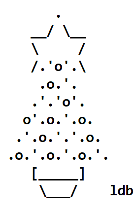

# Advent of Code 2018



This is an implementation of Advent of Code 2018
in the programming language Rust. It can be compiled
and executed on Windows, Linux and MacOSX. The program
will contain all the days that i have time to implement.
Each day and part will be implemented as a sub command
to the main executable.

*Note!* Requires Rust 2018 Edition or later

## Compiling
```
$ cargo build
```

## Running
```
$ advent_of_code_2018 --help
```

